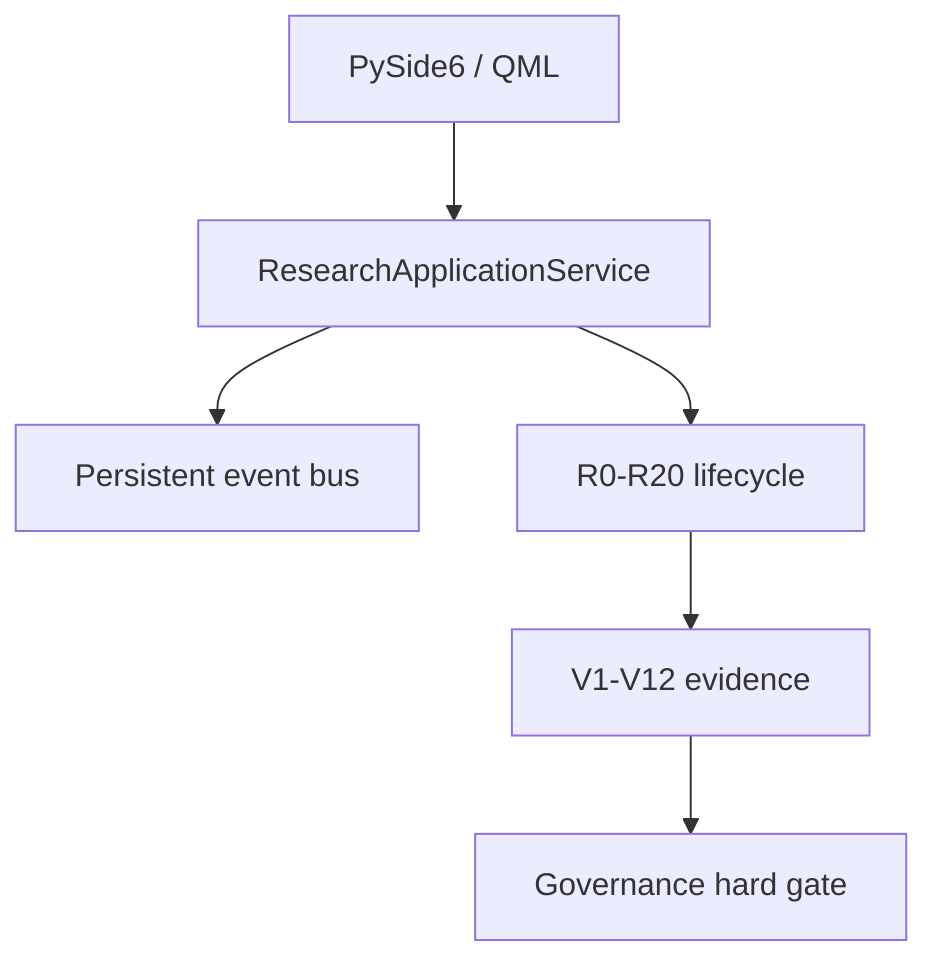

# Composite Verification Research Workbench

This branch refines Quant Ultra around one rule: independent evidence dimensions remain independently visible. There is no composite verification score and no AI vote can activate production.

## Runtime boundaries



QML sees stable Qt models and command methods only. It does not import the lifecycle, registry storage, provider adapters, policy configuration, or credentials. Expensive research commands execute outside the GUI thread. Application events are redacted, per-run monotonic, duplicate-safe, bounded in memory, hash-chained on disk, and replayable after restart.

## Verification dimensions

| Level | Required evidence | Fail-closed condition |
|---|---|---|
| V1 | source provenance | missing version, hash, or availability time |
| V2 | source independence | insufficient upstream origins or unresolved reconciliation |
| V3 | temporal/PIT validity | static or metamorphic sentinel failure |
| V4 | implementation safety | unresolved critical static/runtime finding |
| V5 | independent implementation | non-blind workspace or L1-L6 divergence |
| V6 | reproduction environment | dirty/unknown Git, shared writable cache, environment mismatch |
| V7 | statistical validity | unknown trial family or unsupported inference |
| V8 | mechanism | unfalsifiable or unsupported mechanism |
| V9 | risk/capacity | missing protected metrics or failed stress |
| V10 | robustness | failed placebo or adversarial family |
| V11 | generalization | target tuning, parameter drift, or incomplete PIT metadata |
| V12 | governance integrity | policy hash mismatch, missing dissent, or absent human authorization |

## Desktop pages

The navigation implements the 16 planned work areas: Dashboard, New Research, Research Flow, Agents, Evidence Nexus, Experiment Lab, Twin Implementation, Verification Matrix, Statistical Observatory, Adversarial Lab, Generalization, Kernel Telemetry, Research Memory, Governance Gate, Reports, and Settings. Every screen shows empty or HOLD states until real evidence exists; demo state must be marked explicitly.

## Local verification

From `Quant-4`:

```bash
python -m compileall -q Research_OS Desktop
python -m ruff check Research_OS tests/test_research_os.py tests/test_composite_verification.py
python -m mypy Research_OS --ignore-missing-imports --cache-dir=.mypy_ci_cache
python -m pytest -q -p no:cacheprovider tests
QT_QPA_PLATFORM=offscreen python -m pytest -q -p no:cacheprovider Desktop/tests
```

The QML smoke test needs the host EGL runtime (`libEGL.so.1` on Linux). CI installs PySide6 on a standard Ubuntu runner and executes it separately from the headless research matrix. Windows and Ubuntu core tests cover Python 3.11 and 3.12. A signed standalone Windows artifact remains a release-pipeline responsibility; source validation does not claim that such an artifact was produced.
