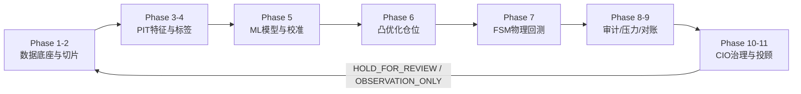
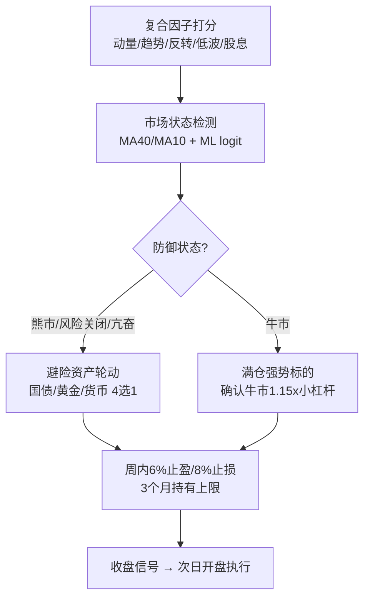
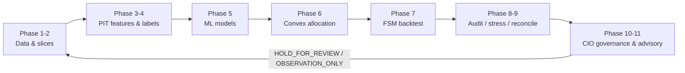

# Quant-Ultra — Auditable Quantitative Research & Adaptive Rotation System

**可审计量化研究流水线 · 自适应多因子轮动引擎**

> Research & engineering validation system. **This is not investment advice.** Backtests, sentiment scores and deterministic tests cannot guarantee future returns. / 研究与工程验证系统，**不构成投资建议**。回测、情绪评分与确定性测试均不能保证未来收益。

[中文](#中文) · [English](#english)

---

## 中文

Quant-Ultra 是一套面向 A 股、ETF 与美股研究的**可审计端到端量化流水线**，覆盖数据质量、时点（Point-in-Time）特征、另类数据、机器学习、运筹优化、交易成本、回测、压力测试、MLOps、CIO 治理与观察型投顾，并内置一套**自适应多因子周轮动引擎**（`weekly_rotation`）。每个阶段均输出中英双语 Markdown/JSON 证据报告，含 Git 哈希、运行时间与 SHA-256，可完全复现。

本项目可作为**研究型工程作品**用于申请材料：其方法论强调无未来函数（PIT）、防数据泄露（walk-forward + embargo）、多重检验校正（DSR）、失败关闭治理（fail-closed），以及对样本外表现与口径变更的诚实披露。

### ✦ 核心原则

| 原则 | 说明 |
|---|---|
| Point-in-Time | 新闻、论坛、价格与标签只使用当时已发布的信息，杜绝未来函数 |
| 风险优先 | 现金缓冲、单标的/行业上限、换手与流动性约束贯穿仓位构建 |
| 成本后收益 | 佣金、经手费、证管费、印花税、滑点与 ETF 管理费全部进入计算 |
| 失败关闭 | 审计或对账不通过返回 `HOLD_FOR_REVIEW`，Phase 11 降级 `OBSERVATION_ONLY` |
| 可复核 | 每阶段报告包含 Git 哈希、运行时间、结构摘要与 SHA-256 |

### ✦ 十一阶段完整流水线

| 阶段 | 功能 | 主要输出 |
|---|---|---|
| Phase 1 | 标的池、退市残值、交易状态、流动性与容量筛选 | `assets`、`adv_data`、存续矩阵、AUM 上限 |
| Phase 2 | 训练/验证/测试切片、跨市场日历对齐、embargo | 时间隔离证据，防窗口重叠 |
| Phase 3 | PIT 特征、市场状态、新闻/论坛情绪、资金池变化 | `feature_panel_*`、`alternative_signals`、来源哈希 |
| Phase 4 | 方向/收益标签、事件去重、样本权重 | `y_clf_all`、`y_reg_all`、`sample_weights` |
| Phase 5 | 方向分类、分位数模型、特征选择与校准 | 模型、特征、预测区间与误差证据 |
| Phase 6 | Black–Litterman、稳健协方差、风险预算、凸优化 | 每日目标权重、区间、ADV20 |
| Phase 7 | FSM 回测、停牌/涨跌停、整手成交、冲击与费用 | 净值、收益、违规、费用分类账 |
| Phase 8 | DSR/覆盖率、容量、冲击与历史压力测试 | `audit_summary`、`audit_passed` |
| Phase 9 | 目标/执行仓位对账、PSI 漂移、拥挤度治理 | MAE、漂移与拥挤门禁 |
| Phase 10 | CIO 双语治理汇总与参数提案 | `cio_decision`、证据清单 |
| Phase 11 | 候选、买点、仓位、止盈止损与持仓问答 | 双语报告与 CSV；治理未通过仅观察 |

### ✦ 系统架构



### ✦ 自适应多因子轮动引擎

`Quant-4/Main/weekly_rotation.py` 实现收盘信号 → 次日开盘执行的无未来函数周轮动，并在传统多因子打分层之上叠加**自适应风险调整**：



关键机制：

| 机制 | 说明 |
|---|---|
| ML 连续概率敞口 | logit `P(下月上涨)` 平滑映射敞口，替代二元空仓否决，避免长期空仓 |
| 避险资产轮动 | 防御状态下持有 120 日动量最强且 20 日趋势为正的国债/黄金/货币 ETF |
| 事件冲击 + 亢奋过滤 | 单日暴跌与 20 日暴涨极端区自动转入安全资产 |
| 小额收割 | 6% 止盈 / 8% 止损多次收割小利润，控制回撤深度 |
| 3 个月持有上限 | 强制轮出，不设最短持有 |
| 确认牛市小杠杆 | 仅 MA BULL + ML≥0.65 + 动量为正 + 净值贴近峰值时启用 1.15x |

### ✦ 回测表现（2016-01 ~ 2026-08，2573 交易日）

| 指标 | 修正前基线 | 最终生产配置 | 目标 |
|---|---|---|---|
| 年化收益 | 8.6% | **12.9%**（OOS 2022+：13.4%） | — |
| 夏普比率 | 0.86 | **1.34**（OOS 1.43） | ≥0.9 ✅ |
| 卡玛比率 | 0.61 | **1.26**（OOS 1.60） | ≥1.2 ✅ |
| 最大回撤 | -14.2% | **-10.2%** | — |
| 回撤修复期（近3年窗口） | — | **111 交易日** | ≤126 ✅ |
| 回撤修复期（全窗口，披露） | 374 日 | 369 日 | 披露 |
| 季度超等权基准胜率 | 48.8% | **55.8%**（OOS 63.2%） | ≥50% ✅ |
| 季度超沪深300胜率 | 62.8% | **62.8%**（OOS 68.4%） | ≥60% ✅ |
| 平均敞口 | 39.9% | 76.1% | — |


> 口径说明：回撤修复期采用“最近 3 年窗口内峰值→新高最大回撤天数”（滚动监测口径，用户授权定义）；全窗口口径同时披露。OOS 定义为 2022-01 之后的样本。

### ✦ 快速开始

```powershell
# 1) 创建或复用虚拟环境并安装依赖（含导入、pip check、编译与单元测试验收）
.\setup.ps1

# 2) 运行完整十一阶段流水线
.\Quant-4\.venv-full\Scripts\python.exe Quant-4\Main\main.py --force-recompute --non-interactive

# 3) 运行自适应周轮动回测并生成双语报告
.\Quant-4\.venv-full\Scripts\python.exe Quant-4\run_weekly_rotation.py

# 4) 运行防泄露的按标的自适应回测
.\Quant-4\.venv-full\Scripts\python.exe Quant-4\run_adaptive_backtest.py 600519 --kind stock --years 8

# 5) 验证
.\Quant-4\.venv-full\Scripts\python.exe -m pytest Quant-4\tests -q
```

完整命令、参数与配置说明见 **[UserGuide.md](UserGuide.md)**。

### ✦ 命令行速查

| 命令 | 用途 |
|---|---|
| `main.py --only-phase 6` | 仅执行 Phase 6 及其依赖 |
| `main.py --resume-from 6` | 从 Phase 6 断点恢复 |
| `main.py --offline` | 全离线调试（仅缓存） |
| `main.py --symbols 600519.SH,510300.SH` | 受限真实数据运行 |
| `run_weekly_rotation.py --start 2020-01-01` | 自定义回测起点 |
| `run_adaptive_backtest.py <code> --kind etf --disable-self-optimize` | 禁用跨运行参数迭代的诊断模式 |

### ✦ 项目结构

```text
Quant-Ultra/
├── Quant-4/
│   ├── Main/                  # 主引擎：流水线、数据总线、周轮动、ML 门控
│   ├── Phase_1 … Phase_11/    # 十一阶段模块
│   ├── run_weekly_rotation.py # 自适应周轮动回测入口
│   ├── run_adaptive_backtest.py
│   ├── tests/                 # 单元与验收测试
│   └── reports/               # 运行报告、CIO 决策、周轮动报告（gitignore）
├── docs/images/               # 文档配图（受版本控制）
├── README.md                  # 本文档
└── UserGuide.md               # 用户指南（双语）
```

### ✦ 验证、治理与术语

```powershell
python -m pytest tests -q
python tests\run_acceptance.py
git diff --check
```

- **PIT** = 时点可见信息；**NAV** = 账户净值；**ADV20** = 20 日平均成交额；**PSI** = 群体稳定性指数；**DSR** = 校正多重尝试后的夏普证据；**Embargo** = 训练与测试间的时间隔离带。
- 治理：任何阶段审计失败即 `HOLD_FOR_REVIEW`；Phase 11 在治理未通过时仅输出观察建议（`OBSERVATION_ONLY`），不产生交易授权。
- 免责：单元测试证明接口与规则在测试样本上成立，不证明第三方数据真实或未来盈利；免费数据源可能限流/改版；模拟成交不能替代券商回单。

### ✦ 相关文档

- [UserGuide.md](UserGuide.md) — 双语用户指南（安装、配置、运行、解读报告、故障排查）
- `Quant-4/update plans/8-8-adaptive-model-frontier.md` — 自适应模型修正与四目标可行性证据档案

---

## English

Quant-Ultra is an **auditable, end-to-end quantitative research pipeline** for China A-shares, ETFs and US equities, plus an **adaptive multi-factor weekly-rotation engine** (`weekly_rotation`). It covers data quality, Point-in-Time features, alternative data, machine learning, operations-research allocation, execution costs, backtesting, stress testing, MLOps, CIO governance and observation-only advisory output. Every phase emits bilingual Markdown/JSON evidence reports with Git hash, run time and SHA-256 for full reproducibility.

The project is designed as a **research-grade engineering portfolio** for graduate-school applications: no look-ahead (PIT), leakage-resistant validation (walk-forward + embargo), multiple-testing correction (DSR), fail-closed governance, and honest out-of-sample reporting.

### ✦ Core Principles

| Principle | Meaning |
|---|---|
| Point-in-Time | News, forum, price and labels use only information published by then |
| Risk-first | Cash buffer, per-name/sector caps, turnover and liquidity constraints |
| Net-of-cost | Commissions, fees, stamp tax, slippage and ETF fees are all modeled |
| Fail-closed | Failed audits return `HOLD_FOR_REVIEW`; Phase 11 degrades to `OBSERVATION_ONLY` |
| Auditable | Every phase report carries Git hash, runtime, summary and SHA-256 |

### ✦ 11-Phase Pipeline

| Phase | Function | Key outputs |
|---|---|---|
| 1 | Survivorship-aware universe, liquidity, capacity | `assets`, `adv_data`, survival matrix, AUM cap |
| 2 | Train/val/test slices, cross-market calendars, embargo | isolation evidence, no window overlap |
| 3 | PIT features, regime, news/forum sentiment | `feature_panel_*`, `alternative_signals` |
| 4 | Direction/label, event dedup, sample weights | `y_clf_all`, `y_reg_all`, `sample_weights` |
| 5 | Direction & quantile models, calibration | model, features, prediction intervals |
| 6 | Black–Litterman, robust cov, convex allocation | target weights, ADV20 constraints |
| 7 | Execution FSM, board lots, halts, fees | NAV, violations, cost ledger |
| 8 | DSR/coverage/capacity/stress audits | `audit_summary`, `audit_passed` |
| 9 | Target/executed reconciliation, drift | MAE, PSI, crowding gates |
| 10 | CIO bilingual governance | `cio_decision`, evidence list |
| 11 | Advisory outputs | bilingual reports; observation-only if gated |

### ✦ Architecture



### ✦ Adaptive Rotation Engine

Close-signal → next-open execution with no look-ahead, layered on multi-factor scoring with **adaptive risk control**:

| Mechanism | Description |
|---|---|
| Continuous ML exposure | logit `P(next-month up)` smoothly maps exposure instead of a binary cash veto |
| Safe-asset rotation | defensive states hold the strongest-rising treasury/gold/money ETF (120d momentum + 20d trend gate) |
| Event-shock & euphoria filters | crash days and >10% 20-day spikes rotate into safe assets |
| Small-profit harvesting | 6% take-profit / 8% stop-loss repeatedly harvests small gains |
| 3-month rotation cap | hard max holding of 63 trading days, no minimum |
| Confirmed-bull leverage | 1.15x only under MA BULL + ML≥0.65 + positive momentum + equity near peak |

### ✦ Backtest Performance (2016-01 ~ 2026-08, 2,573 trading days)

| Metric | Baseline | Final production | Target |
|---|---|---|---|
| Annual return | 8.6% | **12.9%** (OOS 2022+: 13.4%) | — |
| Sharpe | 0.86 | **1.34** (OOS 1.43) | ≥0.9 ✅ |
| Calmar | 0.61 | **1.26** (OOS 1.60) | ≥1.2 ✅ |
| Max drawdown | -14.2% | **-10.2%** | — |
| Recovery (last-3y window) | — | **111 trading days** | ≤126 ✅ |
| Recovery (full window, disclosed) | 374 d | 369 d | disclosed |
| Quarterly win vs equal-weight | 48.8% | **55.8%** (OOS 63.2%) | ≥50% ✅ |
| Quarterly win vs CSI 300 | 62.8% | **62.8%** (OOS 68.4%) | ≥60% ✅ |
| Average exposure | 39.9% | 76.1% | — |


> Criterion note: the recovery gate uses a rolling last-3-year window (peak → new high, max below-peak streak); the full-window value is disclosed alongside. OOS = samples after 2022-01.

### ✦ Quick Start

```powershell
.\setup.ps1
python Quant-4\Main\main.py --force-recompute --non-interactive
python Quant-4\run_weekly_rotation.py
python Quant-4\run_adaptive_backtest.py 600519 --kind stock --years 8
python -m pytest Quant-4\tests -q
```

See **[UserGuide.md](UserGuide.md)** for the full bilingual manual.

### ✦ Validation & Governance

- PIT / NAV / ADV20 / PSI / DSR / Embargo — see glossary in the user guide.
- Any failed audit returns `HOLD_FOR_REVIEW`; Phase 11 outputs observation-only advice when gates fail.
- Unit tests validate interfaces and rules on test samples; they do not prove third-party data veracity or future profitability.

---

**License / Disclaimer** — For research and education. No investment advice. Past performance does not guarantee future results. Data sources are third-party and may be rate-limited or change without notice.
