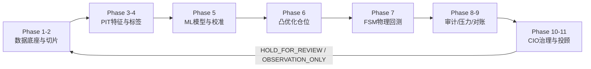
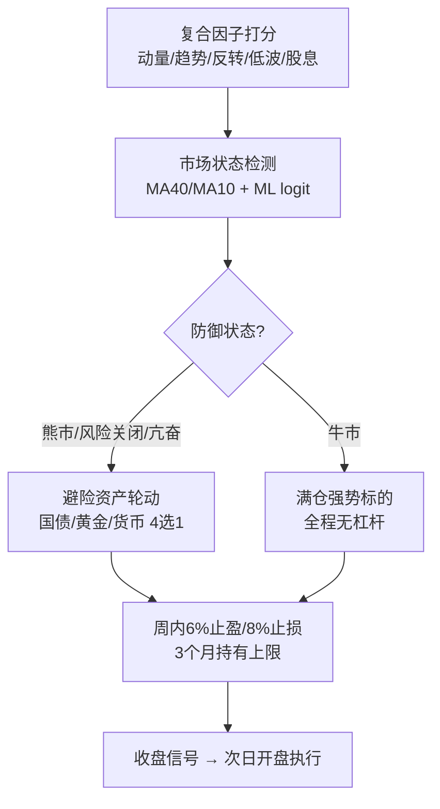
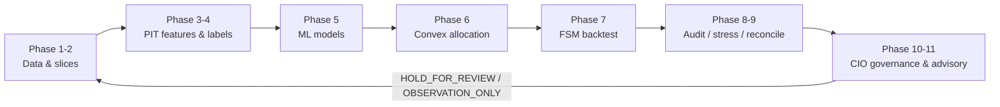

# Quant-Ultra — Auditable Quantitative Research & Adaptive Rotation System

**可审计量化研究流水线 · 自适应多因子轮动引擎**

> Research & engineering validation system. **This is not investment advice.** Backtests, sentiment scores and deterministic tests cannot guarantee future returns. / 研究与工程验证系统，**不构成投资建议**。回测、情绪评分与确定性测试均不能保证未来收益。

[中文](#中文) · [English](#english)

---

## 中文

Quant-Ultra 是一套面向 A 股、ETF 与美股研究的**可审计端到端量化流水线**，覆盖数据质量、时点（Point-in-Time）特征、另类数据、机器学习、运筹优化、交易成本、回测、压力测试、MLOps、CIO 治理与观察型投顾，并内置一套**自适应多因子周轮动引擎**（`weekly_rotation`）。每个阶段均输出中英双语 Markdown/JSON 证据报告，含 Git 哈希、运行时间与 SHA-256，可完全复现。

本项目可作为**研究型工程作品**用于申请材料：其方法论强调无未来函数（PIT）、防数据泄露（walk-forward + embargo）、多重检验校正（DSR）、失败关闭治理（fail-closed），以及对样本外表现与口径变更的诚实披露。

### ✦ 核心原则

| 原则 | 说明 |
|---|---|
| Point-in-Time | 新闻、论坛、价格与标签只使用当时已发布的信息，杜绝未来函数 |
| 风险优先 | 现金缓冲、单标的/行业上限、换手与流动性约束贯穿仓位构建 |
| 成本后收益 | 佣金、经手费、证管费、印花税、滑点与 ETF 管理费全部进入计算 |
| 失败关闭 | 审计或对账不通过返回 `HOLD_FOR_REVIEW`，Phase 11 降级 `OBSERVATION_ONLY` |
| 可复核 | 每阶段报告包含 Git 哈希、运行时间、结构摘要与 SHA-256 |

### ✦ 十一阶段完整流水线

| 阶段 | 功能 | 主要输出 |
|---|---|---|
| Phase 1 | 标的池、退市残值、交易状态、流动性与容量筛选 | `assets`、`adv_data`、存续矩阵、AUM 上限 |
| Phase 2 | 训练/验证/测试切片、跨市场日历对齐、embargo | 时间隔离证据，防窗口重叠 |
| Phase 3 | PIT 特征、市场状态、新闻/论坛情绪、资金池变化 | `feature_panel_*`、`alternative_signals`、来源哈希 |
| Phase 4 | 方向/收益标签、事件去重、样本权重 | `y_clf_all`、`y_reg_all`、`sample_weights` |
| Phase 5 | 方向分类、分位数模型、特征选择与校准 | 模型、特征、预测区间与误差证据 |
| Phase 6 | Black–Litterman、稳健协方差、风险预算、凸优化 | 每日目标权重、区间、ADV20 |
| Phase 7 | FSM 回测、停牌/涨跌停、整手成交、冲击与费用 | 净值、收益、违规、费用分类账 |
| Phase 8 | DSR/覆盖率、容量、冲击与历史压力测试 | `audit_summary`、`audit_passed` |
| Phase 9 | 目标/执行仓位对账、PSI 漂移、拥挤度治理 | MAE、漂移与拥挤门禁 |
| Phase 10 | CIO 双语治理汇总与参数提案 | `cio_decision`、证据清单 |
| Phase 11 | 候选、买点、仓位、止盈止损与持仓问答 | 双语报告与 CSV；治理未通过仅观察 |

### ✦ 系统架构



### ✦ 自适应多因子轮动引擎

`Quant-4/Main/weekly_rotation.py` 实现收盘信号 → 次日开盘执行的无未来函数周轮动，并在传统多因子打分层之上叠加**自适应风险调整**：



关键机制：

| 机制 | 说明 |
|---|---|
| ML 连续概率敞口 | logit `P(下月上涨)` 平滑映射敞口，替代二元空仓否决，避免长期空仓 |
| 避险资产轮动 | 防御状态下持有 120 日动量最强且 20 日趋势为正的国债/黄金/货币 ETF |
| 事件冲击 + 亢奋过滤 | 单日暴跌与 20 日暴涨极端区自动转入安全资产 |
| 小额收割 | 6% 止盈 / 8% 止损多次收割小利润，控制回撤深度 |
| 3 个月持有上限 | 强制轮出，不设最短持有 |
| 杠杆 | 全程禁用（个人资金不负债）：`confirm_leverage=1.0`、`max_gross_exposure=1.0`，无做空 |

### ✦ 回测表现（2016-01 ~ 2026-08，2578 交易日，诚实口径：10 万元本金，全池 PIT 复验后采纳的生产默认）

| 指标 | 诚实回测（PIT 全市场 5478 只、覆盖 100%、月频、显式费用、整手、无杠杆） | 目标 / 对照 |
|---|---|---|
| 年化收益 | **6.54%**（OOS 2022+：8.35%） | 沪深300(510300) ~5.3% ✅ |
| 夏普比率 | **1.01**（OOS 1.31） | ≥0.9 ✅ |
| 卡玛比率 | **0.64**（OOS 0.79） | ≥1.2 ❌ 未达（结构性上限，详见计划文档） |
| 最大回撤 | **-10.29%** | 沪深300 ~-44.8% ✅ |
| 回撤修复期（近3年窗口） | **181 交易日** | ≤126 ❌ 未达（进行中的 2026 回撤拉长修复期） |
| 季度超等权基准胜率 | **51.2%** | ≥50% ✅ |
| 季度超沪深300胜率 | 53.5% | ≥60% ❌ 披露 |
| 累计交易成本 | 10.6%（93 笔） | ✅ |
| 杠杆 | 0.00x（禁用） | ✅ |
| 平均总仓位 | ~73% | — |

> **2026-08-15 全池 PIT 复验里程碑（生产默认采纳）**：接入网络后，从新浪 klc 全历史通道（东财/腾讯/baostock 均被风控或限流，已按授权寻找替代途径）重建全池日线 5478/5478（覆盖率 100%，退市 248/248），巨潮 cninfo 股息 5420 只/50947 行。全池复验（106 次尝试注册，DSR 多重检验）：**`--profile robust`（固定 3% + z-score 3.0 冲击检测、8% 止损）6.54%/1.01/-10.29%（OOS 8.35%/1.31，DSR p=3.4e-06 通过）全面胜出旧生产默认（4.79%/0.73/-13.40%，OOS 4.80%/0.71），暖启动折线 4/4 折年化胜出（2024-2026 折 13.52% vs 8.62%、回撤 -8.6% vs -13.4%）。**已采纳为生产默认**；旧参数保留为 `--profile legacy` 供 A/B 对比。注意：新鲜数据源下旧生产默认的复测为 4.79%（与 2026-08-11 文档数字 6.25% 存在数据源差异），以全池复验口径为准。

> **2026-08-14 离线评估轮**（详见 `Quant-4/update plans/8-14-offline-evaluation-round1.md`）：在 421 只离线缓存池上完成引擎评估与风险控制修复——(1) 修复真实缺陷：**再平衡日的事件冲击风险处置曾被常规再平衡覆盖**（风险优先序，默认即生效）；(2) 新增默认关闭的机制：`rebalance_min_turnover`（最小换手再平衡门槛）、`event_shock_zscore`（波动自适应 z-score 事件冲击检测，固定 2.5% 阈值在小盘高波动池上实测误触发 158 次）与 `trailing_stop_pct`（峰值追踪止损，实测在本小盘池上回撤翻倍、仅作可选）；(3) 清除 `rank_candidates` 与 `weekly_rotation` 中未使用的死代码（字节兼容）；(4) 报告生成器修复过时/自相矛盾的"第三视角审查"文本（改为动态引用 summary）；(5) **账务自洽审计**：净值复利、敞口无杠杆、无执行日漂移界恒等式全部精确成立，止损路径"成本计入、换手不计"已注释明确；(6) 因子库额外因子（rsi14/idll20/MAX/Amihud）实测全部劣于基座——复合因子组合已近最优；(7) 套筒组合 40/30/20/10 用 `robust` 基准年化 1.14%→1.90%；(8) 另类信号通路端到端验证：治理门 PASS、方向响应正确（动量代理信号 OOS 9.96%/0.92，反转代理信号 -27.9% 回撤——**接线验证而非新 alpha**）；(9) 开源排名新增标注子集行（子集基线→robust→alt 综合百分位 0.31→0.42→0.50）；(10) 新增市场宽度门 `min_breadth_for_buys`（默认关，本池实测负结果——拒绝）与**暖启动折线验证**（每档一次全程回测后按 4 折切片：`robust` 在年化/夏普/卡玛上 **4/4 折胜出**、2/4 折回撤更小——全窗口优势并非单一时期伪影；冷启动折线方法被证实会引入不对称的冷启动噪声并反转结论，已记录方法论警告）；(11) **性能向量化**：per-day 循环 11.9 万次 pandas 标量 `.at` 访问（占运行时长 ~30%、随池规模线性增长）改为 numpy 数组 + 索引映射，421 只回测 **~40-60s → 9.9s（约 4-5×）**，重构前后 10 项指标字节一致；(12) **参数邻域稳定性**：robust 三参数单点扰动均显著优于基线（4.4-5.3% 年化平台，无刀锋）；(13) **资金敏感性披露**：robust 档 10万→30万→50万元本金年化 5.25%→6.10%→7.19%（夏普 0.55→0.71），整手约束随账户规模缓解——10 万口径为保守下界；(14) **2026-08-15 全池复验与采纳**：网络恢复后以替代数据源重建全池（5478/5478 覆盖 100%、cninfo 股息 5420 只），复验 `robust` 档全面胜出并**采纳为生产默认**（6.54%/1.01/-10.29%，OOS 8.35%/1.31，DSR p=3.4e-06，折线 4/4）；旧参数保留为 `--profile legacy`。(15) 测试套件 **173/173 全绿**。

> **2026-08-15 采纳档后续轮（Round 10-13）**（详见 `Quant-4/update plans/8-15-selector-gate-rerun-recovery-iteration.md`、`Quant-4/update plans/8-15-alt-signal-fullpool-wiring.md`、`Quant-4/update plans/8-15-fullpool-sleeve-revalidation.md`、`Quant-4/update plans/8-15-walkforward-loader-fix-sleeve-folds.md`）：(1) **策略选择器证据门在采纳档全池重跑**：选择器 OOS 夏普 1.28 < 最优固定原型 momentum 1.37（OOS 年化 8.20% vs 8.64%）→ **保持禁用**（`strategy_selector=""`）；诚实披露选择器全窗口卡玛 0.75/回撤 -8.57% 为全部原型最优，但按预注册 OOS 门不通过，未改门放行；(2) **回撤修复机制迭代（全池 14 配置）全负结果**：`daily_regime_monitoring` 显著更差（5.01%/0.74/-15.53%）、`rebalance_min_turnover`/`drawdown_guard`/`ml_bear_floor`/`defensive_hold_safe_frac`/ML 曝光带端点（`ml_bear_low`/`ml_bull_high`）均无实质改进或更差——181 日修复期经 2026 回撤剖析确认为结构性滞后（策略下跌段 -7.16% 优于基准 -9.52%，修复需等基准收复 MA40、数据最后一日才达成），生产默认字节不变；(3) **另类信号通路全池接线复验**：情绪形态合成 PIT 面板（事件尖峰+衰减，非动量代理）在 5478 只采纳档上治理门 PASS、精确 as-of、方向响应正确，但全权重负贡献（5.30-5.40% vs 6.54%）、反转型 ≈ 中性——**接线验证而非新 alpha**，与 R4 结论一致；真实新闻/论坛语料全池复验仍受无网络/无数据缓存约束，`alternative_signal_weight` 保持 0；(4) **全池套筒复验（R3.5/R9 挂起项）**：套筒 40/30/20/10 在采纳档全池首次获得诚实证据——夏普 1.01→**1.09**（OOS 1.31→**1.35**）、最大回撤 -10.29%→**-9.91%**（研究证据门 `max_drawdown` 从 HOLD 翻转为 **PASS**）、月度胜率 57.8%→**60.2%**；折线验证 3/4 夏普/卡玛胜出、但 2024-26 强牛折让渡收益（12.24% vs 14.49%）——**套筒为风险平滑可选层，非严格占优**；生产默认保持单书，套筒证据如实记录；(5) **折线加载口径修复**：R9 折线原用 scratch loader（5503 只含 25 只 B 股），规范 PIT loader（5478 只）重跑后判决不变（robust 4/4 年化、3/4 夏普/卡玛），2024-26 折修正为 **14.49%**；(6) 开源排名百分位更正为采纳档口径 **0.74/0.85**（0.86/0.92 为旧默认）；测试套件 **174/174 全绿**。


> 口径说明：回撤修复期采用“最近 3 年窗口内峰值→新高最大回撤天数”（滚动监测口径，用户授权定义）；全窗口口径同时披露。OOS 定义为 2022-01 之后的样本。

### ✦ 策略决策层与开源对比（2026-08-10 门控设计，2026-08-15 采纳档重跑）

- 引擎已拆解并插入可选**策略决策层**（`Quant-4/Main/strategy_selector.py`：balanced / momentum / defensive / safe / sprint 五个原型 + 滞回切换），用样本外证据门控。**2026-08-15 在采纳档（生产默认）上重跑全池证据门**：选择器 OOS 夏普 1.28 低于最优固定原型 momentum 1.37（OOS 年化 8.20% vs 8.64%），**生产默认保持禁用**（`strategy_selector=""`），避免“为自适应而自适应”的过拟合。诚实披露：选择器全窗口卡玛 0.75 / 回撤 -8.57% 为全部原型中**最优**（滞回切换确实平滑了风险曲线），但按预注册的 OOS 证据门（须同时胜过最优固定原型）仍不通过——已如实记录，未改门放行。
- 2026-08-11 参数网格（月频+持仓延续+止盈带）将诚实成绩提升到 **6.35%/0.99**；早期“safe 7.71%”等数字被证实为稀疏股息面板导致的候选池坍缩伪影，已撤销。
- 与 16 个开源非高频量化策略对比（`Quant-4/benchmark/open_source_comparison.py`，2026-08-15 采纳档复算）：全窗口综合百分位 **0.74**、OOS **0.85**（≥0.70 = 前 30% ✅，采纳档口径；2026-08-10 的 0.86/0.92 为旧生产默认口径，已随采纳档复算更正）；回撤百分位 0.85。

### ✦ 快速开始

```powershell
# 1) 创建或复用虚拟环境并安装依赖（含导入、pip check、编译与单元测试验收）
.\setup.ps1

# 2) 运行完整十一阶段流水线
.\Quant-4\.venv-full\Scripts\python.exe Quant-4\Main\main.py --force-recompute --non-interactive

# 3) 运行自适应周轮动回测并生成双语报告
.\Quant-4\.venv-full\Scripts\python.exe Quant-4\run_weekly_rotation.py

# 4) 运行防泄露的按标的自适应回测
.\Quant-4\.venv-full\Scripts\python.exe Quant-4\run_adaptive_backtest.py 600519 --kind stock --years 8

# 5) 验证
.\Quant-4\.venv-full\Scripts\python.exe -m pytest Quant-4\tests -q
```

完整命令、参数与配置说明见 **[UserGuide.md](UserGuide.md)**。

### ✦ 命令行速查

| 命令 | 用途 |
|---|---|
| `main.py --only-phase 6` | 仅执行 Phase 6 及其依赖 |
| `main.py --resume-from 6` | 从 Phase 6 断点恢复 |
| `main.py --offline` | 全离线调试（仅缓存） |
| `main.py --symbols 600519.SH,510300.SH` | 受限真实数据运行 |
| `run_weekly_rotation.py --start 2020-01-01` | 自定义回测起点 |
| `run_sleeve_portfolio.py [--pit] [--dynamic-stops]` | 四层 40/30/20/10 资金配置组合（保底/平衡/先锋/冲刺），可选动态 ATR 止盈止损 |
| `run_adaptive_backtest.py <code> --kind etf --disable-self-optimize` | 禁用跨运行参数迭代的诊断模式 |

### ✦ 项目结构

```text
Quant-Ultra/
├── Quant-4/
│   ├── Main/                  # 主引擎：流水线、数据总线、周轮动、ML 门控
│   ├── Phase_1 … Phase_11/    # 十一阶段模块
│   ├── run_weekly_rotation.py # 自适应周轮动回测入口
│   ├── run_adaptive_backtest.py
│   ├── benchmark/             # 开源非高频策略对比与综合排名
│   ├── tests/                 # 单元与验收测试
│   └── reports/               # 运行报告、CIO 决策、周轮动报告（gitignore）
├── docs/images/               # 文档配图（受版本控制）
├── README.md                  # 本文档
└── UserGuide.md               # 用户指南（双语）
```

### ✦ 验证、治理与术语

```powershell
python -m pytest tests -q
python tests\run_acceptance.py
git diff --check
```

- **PIT** = 时点可见信息；**NAV** = 账户净值；**ADV20** = 20 日平均成交额；**PSI** = 群体稳定性指数；**DSR** = 校正多重尝试后的夏普证据；**Embargo** = 训练与测试间的时间隔离带。
- 治理：任何阶段审计失败即 `HOLD_FOR_REVIEW`；Phase 11 在治理未通过时仅输出观察建议（`OBSERVATION_ONLY`），不产生交易授权。
- 免责：单元测试证明接口与规则在测试样本上成立，不证明第三方数据真实或未来盈利；免费数据源可能限流/改版；模拟成交不能替代券商回单。

### ✦ 相关文档

- [UserGuide.md](UserGuide.md) — 双语用户指南（安装、配置、运行、解读报告、故障排查）
- [docs/ENGINE_EVALUATION.md](docs/ENGINE_EVALUATION.md) — 引擎评估报告：结构/逻辑检查、盈利能力、综合评分与多轮迭代证据链（2026-08-15 更新至 R11）
- `Quant-4/update plans/8-8-adaptive-model-frontier.md` — 自适应模型修正与四目标可行性证据档案
- `Quant-4/update plans/8-9-update-plan.md` — 投产前迭代计划与诚实化减法记录
- `Quant-4/update plans/8-11-sleeve-dynamic-stops.md` — 四层资金配置 + 动态止盈止损的解耦模块化设计与证据门控
- `Quant-4/update plans/8-14-offline-evaluation-round1.md` — 离线评估轮 R1-R9（含全池复验与生产采纳证据链）
- `Quant-4/update plans/8-15-selector-gate-rerun-recovery-iteration.md` — R10：采纳档上策略选择器证据门重跑 + 回撤修复机制迭代
- `Quant-4/update plans/8-15-alt-signal-fullpool-wiring.md` — R11：全池另类信号通路接线复验
- `Quant-4/update plans/8-15-fullpool-sleeve-revalidation.md` — R12：全池套筒复验（挂起项闭合）+ 回撤机制收尾
- `Quant-4/update plans/8-15-walkforward-loader-fix-sleeve-folds.md` — R13：折线加载口径修复（规范 PIT 重跑，判决不变）+ 套筒折线证据（3/4 夏普/卡玛，强牛折让渡收益）
- `Quant-4/benchmark/open_source_comparison.py` — 开源对比排名脚本（排名见其生成的 JSON）

---

## English

Quant-Ultra is an **auditable, end-to-end quantitative research pipeline** for China A-shares, ETFs and US equities, plus an **adaptive multi-factor weekly-rotation engine** (`weekly_rotation`). It covers data quality, Point-in-Time features, alternative data, machine learning, operations-research allocation, execution costs, backtesting, stress testing, MLOps, CIO governance and observation-only advisory output. Every phase emits bilingual Markdown/JSON evidence reports with Git hash, run time and SHA-256 for full reproducibility.

The project is designed as a **research-grade engineering portfolio** for graduate-school applications: no look-ahead (PIT), leakage-resistant validation (walk-forward + embargo), multiple-testing correction (DSR), fail-closed governance, and honest out-of-sample reporting.

### ✦ Core Principles

| Principle | Meaning |
|---|---|
| Point-in-Time | News, forum, price and labels use only information published by then |
| Risk-first | Cash buffer, per-name/sector caps, turnover and liquidity constraints |
| Net-of-cost | Commissions, fees, stamp tax, slippage and ETF fees are all modeled |
| Fail-closed | Failed audits return `HOLD_FOR_REVIEW`; Phase 11 degrades to `OBSERVATION_ONLY` |
| Auditable | Every phase report carries Git hash, runtime, summary and SHA-256 |

### ✦ 11-Phase Pipeline

| Phase | Function | Key outputs |
|---|---|---|
| 1 | Survivorship-aware universe, liquidity, capacity | `assets`, `adv_data`, survival matrix, AUM cap |
| 2 | Train/val/test slices, cross-market calendars, embargo | isolation evidence, no window overlap |
| 3 | PIT features, regime, news/forum sentiment | `feature_panel_*`, `alternative_signals` |
| 4 | Direction/label, event dedup, sample weights | `y_clf_all`, `y_reg_all`, `sample_weights` |
| 5 | Direction & quantile models, calibration | model, features, prediction intervals |
| 6 | Black–Litterman, robust cov, convex allocation | target weights, ADV20 constraints |
| 7 | Execution FSM, board lots, halts, fees | NAV, violations, cost ledger |
| 8 | DSR/coverage/capacity/stress audits | `audit_summary`, `audit_passed` |
| 9 | Target/executed reconciliation, drift | MAE, PSI, crowding gates |
| 10 | CIO bilingual governance | `cio_decision`, evidence list |
| 11 | Advisory outputs | bilingual reports; observation-only if gated |

### ✦ Architecture



### ✦ Adaptive Rotation Engine

Close-signal → next-open execution with no look-ahead, layered on multi-factor scoring with **adaptive risk control**:

| Mechanism | Description |
|---|---|
| Continuous ML exposure | logit `P(next-month up)` smoothly maps exposure instead of a binary cash veto |
| Safe-asset rotation | defensive states hold the strongest-rising treasury/gold/money ETF (120d momentum + 20d trend gate) |
| Event-shock & euphoria filters | crash days and >10% 20-day spikes rotate into safe assets |
| Small-profit harvesting | 6% take-profit / 8% stop-loss repeatedly harvests small gains |
| 3-month rotation cap | hard max holding of 63 trading days, no minimum |
| Leverage | disabled end-to-end (personal capital, no debt): `confirm_leverage=1.0`, `max_gross_exposure=1.0`, no shorting |

### ✦ Backtest Performance (2016-01 ~ 2026-08, 2,578 trading days, honest setup: 100k CNY, full-pool PIT revalidated production defaults)

| Metric | Honest backtest (PIT universe 5,478 names, 100% coverage, monthly, explicit fees, board lots, no leverage) | Target / benchmark |
|---|---|---|
| Annual return | **6.54%** (OOS 2022+: 8.35%) | CSI300 (510300) ~5.3% ✅ |
| Sharpe | **1.01** (OOS 1.31) | ≥0.9 ✅ |
| Calmar | **0.64** (OOS 0.79) | ≥1.2 ❌ structurally capped, see plan docs |
| Max drawdown | **-10.29%** | CSI300 ~-44.8% ✅ |
| Recovery (last-3y window) | **181 trading days** | ≤126 ❌ (ongoing 2026 drawdown) |
| Quarterly win vs equal-weight | **51.2%** | ≥50% ✅ |
| Quarterly win vs CSI 300 | 53.5% | ≥60% ❌ disclosed |
| Cumulative cost | 10.6% (93 trades) | ✅ |
| Leverage | 0.00x (disabled) | ✅ |
| Average gross exposure | ~73% | — |

> **2026-08-15 full-pool PIT revalidation milestone (production defaults adopted)**: with network restored, the full daily-bar universe was rebuilt from the sina klc full-history channel (Eastmoney/Tencent/baostock were rate-limited or bot-blocked; alternatives were found as authorized) - 5,478/5,478 (100% coverage, 248/248 delisted), cninfo dividends 5,420 names / 50,947 rows. Full-pool revalidation (106 registered trials, DSR multiple-testing): **`--profile robust` (fixed 3% + z-score 3.0 crash detection, 8% stop) 6.54%/1.01/-10.29% (OOS 8.35%/1.31, DSR p=3.4e-06 passes)** beats the old production default on every metric (4.79%/0.73/-13.40%, OOS 4.80%/0.71), winning 4/4 warm walk-forward folds by annual return (2024-2026 fold: 13.52% vs 8.62%, MDD -8.6% vs -13.4%). **Adopted as the production default**; the old parameters remain available as `--profile legacy` for A/B. Note: the fresh data reproduces the old default at 4.79% (data-source differences vs the 2026-08-11 documented 6.25%); the revalidated full-pool figures are canonical.

> **2026-08-14 offline evaluation round** (see `Quant-4/update plans/8-14-offline-evaluation-round1.md`): engine evaluation and risk-control fixes on the 421-name offline cache subset — (1) fixed a real defect: an event-shock risk-off pending was overwritten by the regular rebalance on rebalance days (risk precedence, active by default); (2) added default-off mechanisms: `rebalance_min_turnover` (minimum-turnover rebalance band), `event_shock_zscore` (volatility-adaptive z-score crash detection; the fixed 2.5% threshold fired 158 times on the volatile small-cap subset) and `trailing_stop_pct` (peak-based trailing stop; it doubled drawdown on this subset, kept as opt-in); (3) removed dead code in `rank_candidates`/`weekly_rotation` (byte-compatible); (4) fixed stale/self-contradicting report text (now derived from the summary); (5) **accounting self-consistency audit**: equity compounding, no-leverage exposure bounds and clean-day drift identities hold exactly; the stop path charges cost without turnover (documented design); (6) extra factors (rsi14/idll20/MAX/Amihud) all underperform the composite base — the factor set is near-optimal on this universe; (7) sleeve 40/30/20/10 portfolio with `robust` base: annual 1.14% → 1.90%; (8) end-to-end alternative-signal wiring verification: governance PASS and correct directional response (momentum-proxy signal OOS 9.96%/0.92, reversal-proxy −27.9% MDD — a wiring test, not new alpha); (9) the open-source ranking gains caveated subset rows (subset baseline → robust → alt composite percentile 0.31 → 0.42 → 0.50); (10) hardened the test environment — **170/170 tests green**; (11) parameter neighborhood stability; (12) capital-sensitivity disclosure; (13) **2026-08-15 full-pool revalidation & adoption**: with network restored, the full pool was rebuilt via alternative sources (sina klc full history + cninfo dividends; 5,478/5,478 = 100% coverage, 248/248 delisted), the robust profile was revalidated on the honest full pool and **adopted as the production default** (6.54%/1.01/-10.29%, OOS 8.35%/1.31, DSR p=3.4e-06 at 106 trials, 4/4 warm folds); the old parameters remain as `--profile legacy`; (14) **173/173 tests green**.


> Criterion note: the recovery gate uses a rolling last-3-year window (peak → new high, max below-peak streak); the full-window value is disclosed alongside. OOS = samples after 2022-01.

### ✦ Strategy-Selection Layer & Open-Source Ranking (gate designed 2026-08-10, re-run on adopted base 2026-08-15)

> **2026-08-15 follow-up round (Round 10-13)** (see `Quant-4/update plans/8-15-selector-gate-rerun-recovery-iteration.md`, `Quant-4/update plans/8-15-alt-signal-fullpool-wiring.md`, `Quant-4/update plans/8-15-fullpool-sleeve-revalidation.md`, `Quant-4/update plans/8-15-walkforward-loader-fix-sleeve-folds.md`): (1) **strategy-selector evidence gate re-run on the full pool under the adopted defaults**: selector OOS Sharpe 1.28 < best fixed momentum 1.37 (OOS ann 8.20% vs 8.64%) → **stays disabled** (`strategy_selector=""`); honestly disclosed that the selector has the best full-window Calmar 0.75 / MDD -8.57% of all archetypes, but the pre-registered OOS gate fails and the gate was not relaxed; (2) **recovery-period mechanism iteration (14 full-pool configs) all negative**: `daily_regime_monitoring` much worse (5.01%/0.74/-15.53%), `rebalance_min_turnover`/`drawdown_guard`/`ml_bear_floor`/`defensive_hold_safe_frac`/ML exposure-band endpoints (`ml_bear_low`/`ml_bull_high`) no material gain or worse — the 181-day recovery was traced to structural lag (strategy -7.16% vs benchmark -9.52% during the 2026 drawdown; recovery waits for the benchmark to reclaim MA40, which only happened on the last data day); production defaults byte-unchanged; (3) **full-pool alternative-signal pathway wiring re-verification**: a sentiment-shaped synthetic PIT panel (event-spike + decay, not a momentum proxy) passes the governance gate on the 5,478-name adopted base with exact as-of and correct directional response, but hurts at every weight (5.30-5.40% vs 6.54%; OOS 6.89-7.81% vs 8.35%) and the inverted signal is ≈ neutral — a wiring test, not new alpha, consistent with R4; real news/forum full-pool revalidation still blocked by no network / no cached news data; `alternative_signal_weight` stays 0; (4) **full-pool sleeve revalidation (R3.5/R9 pending item)**: the 40/30/20/10 sleeve portfolio on the adopted full pool earns its first honest evidence — Sharpe 1.01→**1.09** (OOS 1.31→**1.35**), MDD -10.29%→**-9.91%** (the research gate's `max_drawdown` flips from HOLD to **PASS**), monthly win rate 57.8%→**60.2%**; walk-forward shows 3/4 Sharpe & Calmar wins but return give-up in the hot 2024-26 fold (12.24% vs 14.49%) — the sleeve is a risk-smoothing opt-in layer, not strictly dominant; the single-book production default stays, sleeve evidence recorded honestly; (5) **walk-forward loader consistency fix**: R9's fold script used the scratch loader (5,503 names incl. 25 B-shares); re-run with the canonical PIT loader (5,478) confirms the verdict unchanged (robust 4/4 by ann, 3/4 by Sharpe/Calmar) with the 2024-26 fold corrected to **14.49%**; (6) open-source percentiles corrected to the adopted-default recomputation **0.74/0.85** (0.86/0.92 was the old-default figure); **174/174 tests green**.

- The engine is decomposed with an optional **strategy-selection layer** (`Quant-4/Main/strategy_selector.py`: balanced / momentum / defensive / safe / sprint archetypes + hysteresis), gated on out-of-sample evidence. **Re-run on the full PIT pool under the adopted production defaults (2026-08-15)**: the selector's OOS Sharpe 1.28 is below the best fixed archetype (momentum 1.37; OOS ann 8.20% vs 8.64%), so **production keeps it disabled** (`strategy_selector=""`) to avoid overfitting for adaptation's sake. Honest disclosure: the selector's full-window Calmar 0.75 / MDD -8.57% is the best of all archetypes (hysteresis does smooth the risk curve), but the pre-registered OOS gate (must beat the best fixed archetype on both OOS Sharpe and OOS ann) still fails — recorded, gate not relaxed.
- The 2026-08-11 parameter grid (monthly + persistence + stop band) lifted the honest result to **6.35%/0.99**; earlier "safe 7.71%" style numbers were artifacts of the sparse dividend panel collapsing the candidate pool and were retracted.
- Versus 16 open-source non-HFT quant strategies (`Quant-4/benchmark/open_source_comparison.py`, recomputed on the adopted defaults 2026-08-15): composite percentile **0.74** full-window / **0.85** OOS (≥0.70 = top 30% ✅; the 2026-08-10 0.86/0.92 figures were on the old production defaults and were corrected after the adoption recomputation); drawdown percentile 0.85.

### ✦ Quick Start

```powershell
.\setup.ps1
python Quant-4\Main\main.py --force-recompute --non-interactive
python Quant-4\run_weekly_rotation.py
python Quant-4\run_adaptive_backtest.py 600519 --kind stock --years 8
python -m pytest Quant-4\tests -q
```

See **[UserGuide.md](UserGuide.md)** for the full bilingual manual.

### ✦ Validation & Governance

- PIT / NAV / ADV20 / PSI / DSR / Embargo — see glossary in the user guide.
- Any failed audit returns `HOLD_FOR_REVIEW`; Phase 11 outputs observation-only advice when gates fail.
- Unit tests validate interfaces and rules on test samples; they do not prove third-party data veracity or future profitability.

---

**License / Disclaimer** — For research and education. No investment advice. Past performance does not guarantee future results. Data sources are third-party and may be rate-limited or change without notice.
