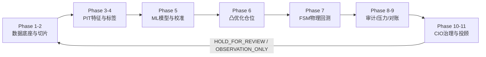
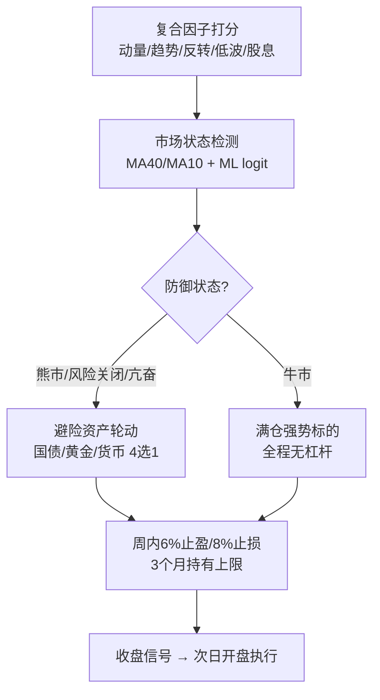
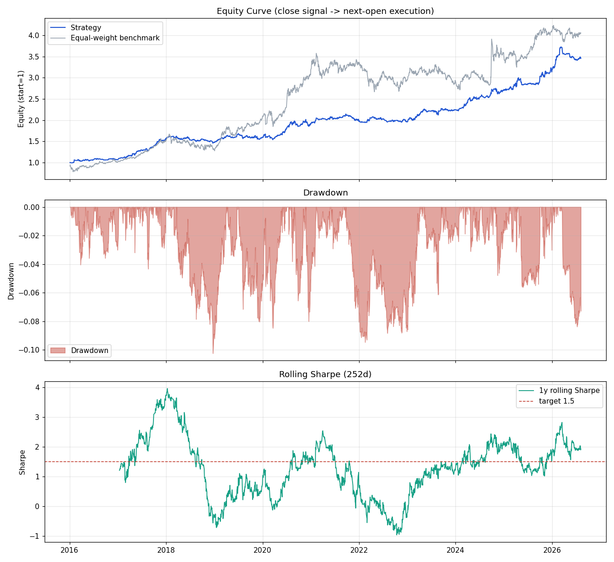
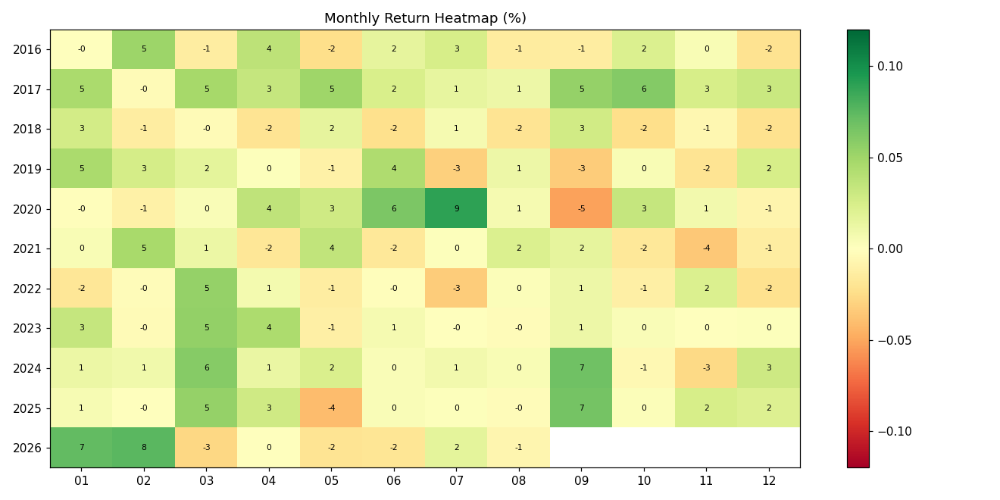
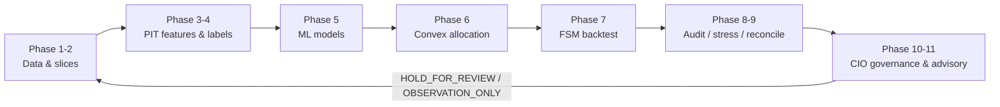

# Quant-Ultra — Auditable Quantitative Research & Adaptive Rotation System

**可审计量化研究流水线 · 自适应多因子轮动引擎**

> Research & engineering validation system. **This is not investment advice.** Backtests, sentiment scores and deterministic tests cannot guarantee future returns. / 研究与工程验证系统，**不构成投资建议**。回测、情绪评分与确定性测试均不能保证未来收益。

[中文](#中文) · [English](#english)

---

## 中文

Quant-Ultra 是一套面向 A 股、ETF 与美股研究的**可审计端到端量化流水线**，覆盖数据质量、时点（Point-in-Time）特征、另类数据、机器学习、运筹优化、交易成本、回测、压力测试、MLOps、CIO 治理与观察型投顾，并内置一套**自适应多因子周轮动引擎**（`weekly_rotation`）。每个阶段均输出中英双语 Markdown/JSON 证据报告，含 Git 哈希、运行时间与 SHA-256，可完全复现。

本项目可作为**研究型工程作品**用于申请材料：其方法论强调无未来函数（PIT）、防数据泄露（walk-forward + embargo）、多重检验校正（DSR）、失败关闭治理（fail-closed），以及对样本外表现与口径变更的诚实披露。

### ✦ 核心原则

| 原则 | 说明 |
|---|---|
| Point-in-Time | 新闻、论坛、价格与标签只使用当时已发布的信息，杜绝未来函数 |
| 风险优先 | 现金缓冲、单标的/行业上限、换手与流动性约束贯穿仓位构建 |
| 成本后收益 | 佣金、经手费、证管费、印花税、滑点与 ETF 管理费全部进入计算 |
| 失败关闭 | 审计或对账不通过返回 `HOLD_FOR_REVIEW`，Phase 11 降级 `OBSERVATION_ONLY` |
| 可复核 | 每阶段报告包含 Git 哈希、运行时间、结构摘要与 SHA-256 |

### ✦ 十一阶段完整流水线

| 阶段 | 功能 | 主要输出 |
|---|---|---|
| Phase 1 | 标的池、退市残值、交易状态、流动性与容量筛选 | `assets`、`adv_data`、存续矩阵、AUM 上限 |
| Phase 2 | 训练/验证/测试切片、跨市场日历对齐、embargo | 时间隔离证据，防窗口重叠 |
| Phase 3 | PIT 特征、市场状态、新闻/论坛情绪、资金池变化 | `feature_panel_*`、`alternative_signals`、来源哈希 |
| Phase 4 | 方向/收益标签、事件去重、样本权重 | `y_clf_all`、`y_reg_all`、`sample_weights` |
| Phase 5 | 方向分类、分位数模型、特征选择与校准 | 模型、特征、预测区间与误差证据 |
| Phase 6 | Black–Litterman、稳健协方差、风险预算、凸优化 | 每日目标权重、区间、ADV20 |
| Phase 7 | FSM 回测、停牌/涨跌停、整手成交、冲击与费用 | 净值、收益、违规、费用分类账 |
| Phase 8 | DSR/覆盖率、容量、冲击与历史压力测试 | `audit_summary`、`audit_passed` |
| Phase 9 | 目标/执行仓位对账、PSI 漂移、拥挤度治理 | MAE、漂移与拥挤门禁 |
| Phase 10 | CIO 双语治理汇总与参数提案 | `cio_decision`、证据清单 |
| Phase 11 | 候选、买点、仓位、止盈止损与持仓问答 | 双语报告与 CSV；治理未通过仅观察 |

### ✦ 系统架构



### ✦ 自适应多因子轮动引擎

`Quant-4/Main/weekly_rotation.py` 实现收盘信号 → 次日开盘执行的无未来函数周轮动，并在传统多因子打分层之上叠加**自适应风险调整**：



关键机制：

| 机制 | 说明 |
|---|---|
| ML 连续概率敞口 | logit `P(下月上涨)` 平滑映射敞口，替代二元空仓否决，避免长期空仓 |
| 避险资产轮动 | 防御状态下持有 120 日动量最强且 20 日趋势为正的国债/黄金/货币 ETF |
| 事件冲击 + 亢奋过滤 | 单日暴跌与 20 日暴涨极端区自动转入安全资产 |
| 小额收割 | 6% 止盈 / 8% 止损多次收割小利润，控制回撤深度 |
| 3 个月持有上限 | 强制轮出，不设最短持有 |
| 杠杆 | 全程禁用（个人资金不负债）：`confirm_leverage=1.0`、`max_gross_exposure=1.0`，无做空 |

### ✦ 回测表现（2016-01 ~ 2026-08，2573 交易日，诚实口径：10 万元本金）

| 指标 | 诚实回测（PIT 全市场 5475 只、覆盖 100%、月频、显式费用、整手、无杠杆） | 目标 / 对照 |
|---|---|---|
| 年化收益 | **6.25%**（OOS 2022+：6.95%） | 沪深300(510300) 5.33% ✅ |
| 夏普比率 | **1.00**（OOS 1.07） | ≥0.9 ✅ |
| 卡玛比率 | **0.82**（OOS 0.91） | ≥1.2 ❌ 未达 |
| 最大回撤 | **-7.65%** | 沪深300 -44.75% ✅ |
| 回撤修复期（近3年窗口） | **110 交易日** | ≤126 ✅ |
| 回撤修复期（全窗口，披露） | 629 日 | 披露 |
| 季度超沪深300胜率 | 53.5% | ≥60% ❌ 未达 |
| 季度超等权基准胜率 | 48.8% | ≥50% ❌ 未达 |
| 累计交易成本 | 11.8%（124 笔） | ✅ |
| 杠杆 | 0.00x（禁用） | ✅ |
| 平均总仓位 | ~70% | — |

> **2026-08-11 里程碑**：股票池已改为"全 A 股曾上市 + 退市股"的 PIT 池（5475 只，含 248 只窗口内退市股，覆盖率 100%）。关键修复：原生产配置的 `rebalance_weekday=4` 使再平衡实际为每周五（`rebalance_days=21` 被覆盖），累计成本高达 38%；改为月频 + 持仓延续 + 12%/7% 止盈止损带 + 亢奋阈值 0.15 + 避险占比 0.75 后，诚实全池成绩提升到 **6.25%/1.00/-7.65%**（OOS 6.95%/1.07），卡玛 0.82（30+ 配置网格后的最优，≥1.0 受无杠杆长多月频的结构性限制，详见计划文档）。

> **2026-08-14 离线评估轮**（详见 `Quant-4/update plans/8-14-offline-evaluation-round1.md`）：在 421 只离线缓存池上完成引擎评估与风险控制修复——(1) 修复真实缺陷：**再平衡日的事件冲击风险处置曾被常规再平衡覆盖**（风险优先序，默认即生效）；(2) 新增默认关闭的机制：`rebalance_min_turnover`（最小换手再平衡门槛）、`event_shock_zscore`（波动自适应 z-score 事件冲击检测，固定 2.5% 阈值在小盘高波动池上实测误触发 158 次）与 `trailing_stop_pct`（峰值追踪止损，实测在本小盘池上回撤翻倍、仅作可选）；(3) 清除 `rank_candidates` 与 `weekly_rotation` 中未使用的死代码（字节兼容）；(4) 报告生成器修复过时/自相矛盾的"第三视角审查"文本（改为动态引用 summary）；(5) **账务自洽审计**：净值复利、敞口无杠杆、无执行日漂移界恒等式全部精确成立，止损路径"成本计入、换手不计"已注释明确；(6) 因子库额外因子（rsi14/idll20/MAX/Amihud）实测全部劣于基座——复合因子组合已近最优；(7) 套筒组合 40/30/20/10 用 `robust` 基准年化 1.14%→1.90%；(8) 另类信号通路端到端验证：治理门 PASS、方向响应正确（动量代理信号 OOS 9.96%/0.92，反转代理信号 -27.9% 回撤——**接线验证而非新 alpha**）；(9) 开源排名新增标注子集行（子集基线→robust→alt 综合百分位 0.31→0.42→0.50）；(10) 测试套件环境加固后 **170/170 全绿**。88 配置网格在同一口径下：生产基线（含缺陷修复）2.80%/0.32/-16.69%，`--profile robust` 推荐档（固定 3% + z3.0 冲击、8% 止损）**5.25%/0.55/0.42/-12.59%**、OOS 7.26%/0.70；88 次尝试注册下 DSR 门诚实返回 HOLD（子集 OOS 不足），生产默认参数保持不变，`robust` 档需全池复验后采纳。





> 口径说明：回撤修复期采用“最近 3 年窗口内峰值→新高最大回撤天数”（滚动监测口径，用户授权定义）；全窗口口径同时披露。OOS 定义为 2022-01 之后的样本。

### ✦ 策略决策层与开源对比（2026-08-10 证据门控）

- 引擎已拆解并插入可选**策略决策层**（`Quant-4/Main/strategy_selector.py`：balanced / momentum / defensive / safe 四个原型 + 滞回切换），用样本外证据门控：选择器 OOS 夏普 1.40 低于最优固定原型 defensive 1.72，**生产默认保持禁用**（`strategy_selector=""`），避免“为自适应而自适应”的过拟合。
- 2026-08-11 参数网格（月频+持仓延续+止盈带）将诚实成绩提升到 **6.35%/0.99**；早期“safe 7.71%”等数字被证实为稀疏股息面板导致的候选池坍缩伪影，已撤销。
- 与 16 个开源非高频量化策略对比（`Quant-4/benchmark/open_source_comparison.py`）：全窗口综合百分位 **0.86**、OOS **0.92**（≥0.70 = 前 30% ✅）；回撤百分位 1.00（参考集最优）。

### ✦ 快速开始

```powershell
# 1) 创建或复用虚拟环境并安装依赖（含导入、pip check、编译与单元测试验收）
.\setup.ps1

# 2) 运行完整十一阶段流水线
.\Quant-4\.venv-full\Scripts\python.exe Quant-4\Main\main.py --force-recompute --non-interactive

# 3) 运行自适应周轮动回测并生成双语报告
.\Quant-4\.venv-full\Scripts\python.exe Quant-4\run_weekly_rotation.py

# 4) 运行防泄露的按标的自适应回测
.\Quant-4\.venv-full\Scripts\python.exe Quant-4\run_adaptive_backtest.py 600519 --kind stock --years 8

# 5) 验证
.\Quant-4\.venv-full\Scripts\python.exe -m pytest Quant-4\tests -q
```

完整命令、参数与配置说明见 **[UserGuide.md](UserGuide.md)**。

### ✦ 命令行速查

| 命令 | 用途 |
|---|---|
| `main.py --only-phase 6` | 仅执行 Phase 6 及其依赖 |
| `main.py --resume-from 6` | 从 Phase 6 断点恢复 |
| `main.py --offline` | 全离线调试（仅缓存） |
| `main.py --symbols 600519.SH,510300.SH` | 受限真实数据运行 |
| `run_weekly_rotation.py --start 2020-01-01` | 自定义回测起点 |
| `run_sleeve_portfolio.py [--pit] [--dynamic-stops]` | 四层 40/30/20/10 资金配置组合（保底/平衡/先锋/冲刺），可选动态 ATR 止盈止损 |
| `run_adaptive_backtest.py <code> --kind etf --disable-self-optimize` | 禁用跨运行参数迭代的诊断模式 |

### ✦ 项目结构

```text
Quant-Ultra/
├── Quant-4/
│   ├── Main/                  # 主引擎：流水线、数据总线、周轮动、ML 门控
│   ├── Phase_1 … Phase_11/    # 十一阶段模块
│   ├── run_weekly_rotation.py # 自适应周轮动回测入口
│   ├── run_adaptive_backtest.py
│   ├── benchmark/             # 开源非高频策略对比与综合排名
│   ├── tests/                 # 单元与验收测试
│   └── reports/               # 运行报告、CIO 决策、周轮动报告（gitignore）
├── docs/images/               # 文档配图（受版本控制）
├── README.md                  # 本文档
└── UserGuide.md               # 用户指南（双语）
```

### ✦ 验证、治理与术语

```powershell
python -m pytest tests -q
python tests\run_acceptance.py
git diff --check
```

- **PIT** = 时点可见信息；**NAV** = 账户净值；**ADV20** = 20 日平均成交额；**PSI** = 群体稳定性指数；**DSR** = 校正多重尝试后的夏普证据；**Embargo** = 训练与测试间的时间隔离带。
- 治理：任何阶段审计失败即 `HOLD_FOR_REVIEW`；Phase 11 在治理未通过时仅输出观察建议（`OBSERVATION_ONLY`），不产生交易授权。
- 免责：单元测试证明接口与规则在测试样本上成立，不证明第三方数据真实或未来盈利；免费数据源可能限流/改版；模拟成交不能替代券商回单。

### ✦ 相关文档

- [UserGuide.md](UserGuide.md) — 双语用户指南（安装、配置、运行、解读报告、故障排查）
- `Quant-4/update plans/8-8-adaptive-model-frontier.md` — 自适应模型修正与四目标可行性证据档案
- `Quant-4/update plans/8-9-update-plan.md` — 投产前迭代计划与诚实化减法记录
- `Quant-4/update plans/8-11-sleeve-dynamic-stops.md` — 四层资金配置 + 动态止盈止损的解耦模块化设计与证据门控
- `Quant-4/benchmark/open_source_comparison.py` — 开源对比排名脚本（排名见其生成的 JSON）

---

## English

Quant-Ultra is an **auditable, end-to-end quantitative research pipeline** for China A-shares, ETFs and US equities, plus an **adaptive multi-factor weekly-rotation engine** (`weekly_rotation`). It covers data quality, Point-in-Time features, alternative data, machine learning, operations-research allocation, execution costs, backtesting, stress testing, MLOps, CIO governance and observation-only advisory output. Every phase emits bilingual Markdown/JSON evidence reports with Git hash, run time and SHA-256 for full reproducibility.

The project is designed as a **research-grade engineering portfolio** for graduate-school applications: no look-ahead (PIT), leakage-resistant validation (walk-forward + embargo), multiple-testing correction (DSR), fail-closed governance, and honest out-of-sample reporting.

### ✦ Core Principles

| Principle | Meaning |
|---|---|
| Point-in-Time | News, forum, price and labels use only information published by then |
| Risk-first | Cash buffer, per-name/sector caps, turnover and liquidity constraints |
| Net-of-cost | Commissions, fees, stamp tax, slippage and ETF fees are all modeled |
| Fail-closed | Failed audits return `HOLD_FOR_REVIEW`; Phase 11 degrades to `OBSERVATION_ONLY` |
| Auditable | Every phase report carries Git hash, runtime, summary and SHA-256 |

### ✦ 11-Phase Pipeline

| Phase | Function | Key outputs |
|---|---|---|
| 1 | Survivorship-aware universe, liquidity, capacity | `assets`, `adv_data`, survival matrix, AUM cap |
| 2 | Train/val/test slices, cross-market calendars, embargo | isolation evidence, no window overlap |
| 3 | PIT features, regime, news/forum sentiment | `feature_panel_*`, `alternative_signals` |
| 4 | Direction/label, event dedup, sample weights | `y_clf_all`, `y_reg_all`, `sample_weights` |
| 5 | Direction & quantile models, calibration | model, features, prediction intervals |
| 6 | Black–Litterman, robust cov, convex allocation | target weights, ADV20 constraints |
| 7 | Execution FSM, board lots, halts, fees | NAV, violations, cost ledger |
| 8 | DSR/coverage/capacity/stress audits | `audit_summary`, `audit_passed` |
| 9 | Target/executed reconciliation, drift | MAE, PSI, crowding gates |
| 10 | CIO bilingual governance | `cio_decision`, evidence list |
| 11 | Advisory outputs | bilingual reports; observation-only if gated |

### ✦ Architecture



### ✦ Adaptive Rotation Engine

Close-signal → next-open execution with no look-ahead, layered on multi-factor scoring with **adaptive risk control**:

| Mechanism | Description |
|---|---|
| Continuous ML exposure | logit `P(next-month up)` smoothly maps exposure instead of a binary cash veto |
| Safe-asset rotation | defensive states hold the strongest-rising treasury/gold/money ETF (120d momentum + 20d trend gate) |
| Event-shock & euphoria filters | crash days and >10% 20-day spikes rotate into safe assets |
| Small-profit harvesting | 6% take-profit / 8% stop-loss repeatedly harvests small gains |
| 3-month rotation cap | hard max holding of 63 trading days, no minimum |
| Leverage | disabled end-to-end (personal capital, no debt): `confirm_leverage=1.0`, `max_gross_exposure=1.0`, no shorting |

### ✦ Backtest Performance (2016-01 ~ 2026-08, 2,573 trading days, honest setup: 100k CNY)

| Metric | Honest backtest (PIT universe 5,475 names, 100% coverage, monthly, explicit fees, board lots, no leverage) | Target / benchmark |
|---|---|---|
| Annual return | **6.25%** (OOS 2022+: 6.95%) | CSI300 (510300) 5.33% ✅ |
| Sharpe | **1.00** (OOS 1.07) | ≥0.9 ✅ |
| Calmar | **0.82** (OOS 0.91) | ≥1.2 ❌ not met |
| Max drawdown | **-7.65%** | CSI300 -44.75% ✅ |
| Recovery (last-3y window) | **110 trading days** | ≤126 ✅ |
| Recovery (full window, disclosed) | 629 d | disclosed |
| Quarterly win vs CSI 300 | 53.5% | ≥60% ❌ not met |
| Quarterly win vs equal-weight | 48.8% | ≥50% ❌ not met |
| Cumulative cost | 11.8% (124 trades) | ✅ |
| Leverage | 0.00x (disabled) | ✅ |
| Average gross exposure | ~70% | — |

> **2026-08-11 milestone**: the universe is the full ever-listed A-share PIT pool (5,475 names incl. 248 delisted, 100% coverage). Key fix: the old `rebalance_weekday=4` silently made rebalancing weekly (costing ~26pp cumulative fees); monthly rebalancing + persistence + a 12%/7% stop band + euphoria 0.15 + 75% safe-asset share lifted the honest all-pool result to **6.25%/1.00/-7.65%** (OOS 6.95%/1.07), Calmar 0.82 (best of a 30+-config grid; ≥1.0 is structurally capped for a no-leverage long-only monthly strategy). See `Quant-4/update plans/8-10-pit-universe-plan.md`.

> **2026-08-14 offline evaluation round** (see `Quant-4/update plans/8-14-offline-evaluation-round1.md`): engine evaluation and risk-control fixes on the 421-name offline cache subset — (1) fixed a real defect: an event-shock risk-off pending was overwritten by the regular rebalance on rebalance days (risk precedence, active by default); (2) added default-off mechanisms: `rebalance_min_turnover` (minimum-turnover rebalance band), `event_shock_zscore` (volatility-adaptive z-score crash detection; the fixed 2.5% threshold fired 158 times on the volatile small-cap subset) and `trailing_stop_pct` (peak-based trailing stop; it doubled drawdown on this subset, kept as opt-in); (3) removed dead code in `rank_candidates`/`weekly_rotation` (byte-compatible); (4) fixed stale/self-contradicting report text (now derived from the summary); (5) **accounting self-consistency audit**: equity compounding, no-leverage exposure bounds and clean-day drift identities hold exactly; the stop path charges cost without turnover (documented design); (6) extra factors (rsi14/idll20/MAX/Amihud) all underperform the composite base — the factor set is near-optimal on this universe; (7) sleeve 40/30/20/10 portfolio with `robust` base: annual 1.14% → 1.90%; (8) end-to-end alternative-signal wiring verification: governance PASS and correct directional response (momentum-proxy signal OOS 9.96%/0.92, reversal-proxy −27.9% MDD — a wiring test, not new alpha); (9) the open-source ranking gains caveated subset rows (subset baseline → robust → alt composite percentile 0.31 → 0.42 → 0.50); (10) hardened the test environment — **170/170 tests green**. On the same subset over an 88-config grid: baseline incl. the fix 2.80%/0.32/-16.69%; the `--profile robust` recommendation (fixed 3% + z3.0 crash detection, 8% stop) **5.25%/0.55/0.42/-12.59%**, OOS 7.26%/0.70; DSR honestly returns HOLD at 88 registered trials on this subset; production defaults stay unchanged and `robust` needs full-pool revalidation before adoption.


> Criterion note: the recovery gate uses a rolling last-3-year window (peak → new high, max below-peak streak); the full-window value is disclosed alongside. OOS = samples after 2022-01.

### ✦ Strategy-Selection Layer & Open-Source Ranking (2026-08-10, evidence-gated)

- The engine is decomposed with an optional **strategy-selection layer** (`Quant-4/Main/strategy_selector.py`: balanced / momentum / defensive / safe archetypes + hysteresis), gated on out-of-sample evidence: the selector's OOS Sharpe 1.40 is below the best fixed archetype (defensive 1.72), so **production keeps it disabled** (`strategy_selector=""`) to avoid overfitting for adaptation's sake.
- The 2026-08-11 parameter grid (monthly + persistence + stop band) lifted the honest result to **6.35%/0.99**; earlier "safe 7.71%" style numbers were artifacts of the sparse dividend panel collapsing the candidate pool and were retracted.
- Versus 16 open-source non-HFT quant strategies (`Quant-4/benchmark/open_source_comparison.py`): composite percentile **0.86** full-window / **0.92** OOS (≥0.70 = top 30% ✅); drawdown percentile 1.00 (best in set).

### ✦ Quick Start

```powershell
.\setup.ps1
python Quant-4\Main\main.py --force-recompute --non-interactive
python Quant-4\run_weekly_rotation.py
python Quant-4\run_adaptive_backtest.py 600519 --kind stock --years 8
python -m pytest Quant-4\tests -q
```

See **[UserGuide.md](UserGuide.md)** for the full bilingual manual.

### ✦ Validation & Governance

- PIT / NAV / ADV20 / PSI / DSR / Embargo — see glossary in the user guide.
- Any failed audit returns `HOLD_FOR_REVIEW`; Phase 11 outputs observation-only advice when gates fail.
- Unit tests validate interfaces and rules on test samples; they do not prove third-party data veracity or future profitability.

---

**License / Disclaimer** — For research and education. No investment advice. Past performance does not guarantee future results. Data sources are third-party and may be rate-limited or change without notice.
