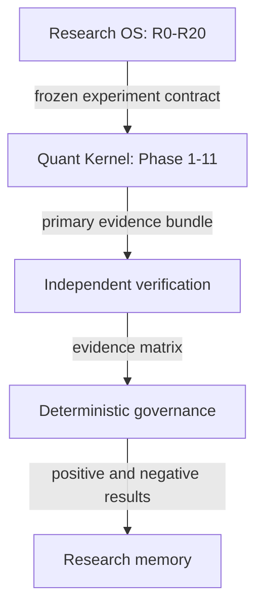

# Quant-Ultra Research OS architecture

## Outcome

Quant-Ultra now has two explicit levels:



The existing `Quant-4/Main/main.py` remains the canonical kernel orchestrator. Phase 1–11, production strategy defaults, risk limits, execution assumptions and reporting were not moved or rewritten. `Main/main_engine.py` remains deprecated and is not imported by Research OS.

## Trust boundary

AI roles can research, implement, validate within their declared domain, criticize and explain. No role has `PRODUCTION` permission. Provider output must be structured and schema-checked. Proposer/verifier separation and implementation/reproduction separation are enforced by identity.

Only deterministic gates can issue `PRODUCTION_CANDIDATE`, and that state still requires human authorization. A critical PIT, implementation or reproduction failure returns `REJECTED`; missing mandatory evidence returns `HOLD_FOR_REVIEW`. Agent votes and source agreement cannot override either result.

## Package map

| Package | Responsibility |
|---|---|
| `contracts` | Immutable versioned research, experiment, evidence, verification and governance objects |
| `registry` | Hash-chained append-only experiment, hypothesis, source and agent-performance state |
| `memory` | Offline structured/lexical semantic, episodic, failure and procedural retrieval |
| `evidence` | Multi-source graph, conflict preservation and PIT/data gates |
| `providers` / `agents` | Provider-neutral roles, deterministic stub, permissions, blinding and audit hashes |
| `verification` | Static leakage checks, independent reproduction and adversarial attack registry |
| `adapters` | Isolated kernel invocation plus current statistics/generalization wrappers |
| `governance` | Deterministic evidence matrix and production invariants |
| `orchestration` | Persisted R0–R20 DAG, bounded retries, budget, cancellation and resume |
| `reporting` | Per-stage evidence files, SHA-256 manifest and human-readable summary |
| `security` | Secret redaction, workspace path containment and controlled execution policy |
| `cli` | Start, resume, show, memory search and experiment inspection |

## Canonical lifecycle

The top-level dependency order is R0 → R1 → … → R20. Internal work may run in parallel later, but aggregation order is deterministic. The default offline workflow is intentionally an architecture demonstration and returns `RESEARCH_ONLY`; it does not claim market alpha.

## Kernel adapter

`Research_OS/adapters/quant_kernel.py` calls only `Main/main.py`, writes experiment overrides to a temporary YAML file, forces `analysis_only: true`, supports a bounded symbol universe, captures stdout/stderr hashes and checks that `Main/default_param.yaml` remains byte-identical. Privileged overlay keys such as live trading or production activation are rejected.

## Verification stack

| Level | Evidence |
|---|---|
| V1 | Source and provenance |
| V2 | Temporal/PIT validity |
| V3 | Implementation and leakage checks |
| V4 | Independent clean-process reproduction |
| V5 | Statistical and multiple-testing evidence |
| V6 | Mechanism/falsifiability |
| V7 | Adversarial robustness/placebos |
| V8 | External generalization with frozen parameters |

The existing `Main/factor_research.py`, `Main/statistical_validation_v2.py`, `Main/generalization_validation.py`, `Main/data_provenance.py`, `Main/data_quality.py` and `Main/reproducibility.py` remain authoritative kernel utilities and are wrapped rather than duplicated.

## Local use

```bash
cd Quant-4
python -m Research_OS.cli.run examples/research_os/synthetic_intake.yaml --offline-agents
python -m Research_OS.cli.resume reports/research_os_state/RUN-ID.json
python -m Research_OS.cli.show reports/research_os_state/RUN-ID.json
python -m Research_OS.cli.memory_search "cash flow quality" --registry path/to/memory.jsonl
python -m Research_OS.cli.experiment EXP-ID --registry path/to/experiments.jsonl
```

Runtime registries, state and reports are local generated artifacts and remain ignored by git. Tests require no paid API and no network access.
